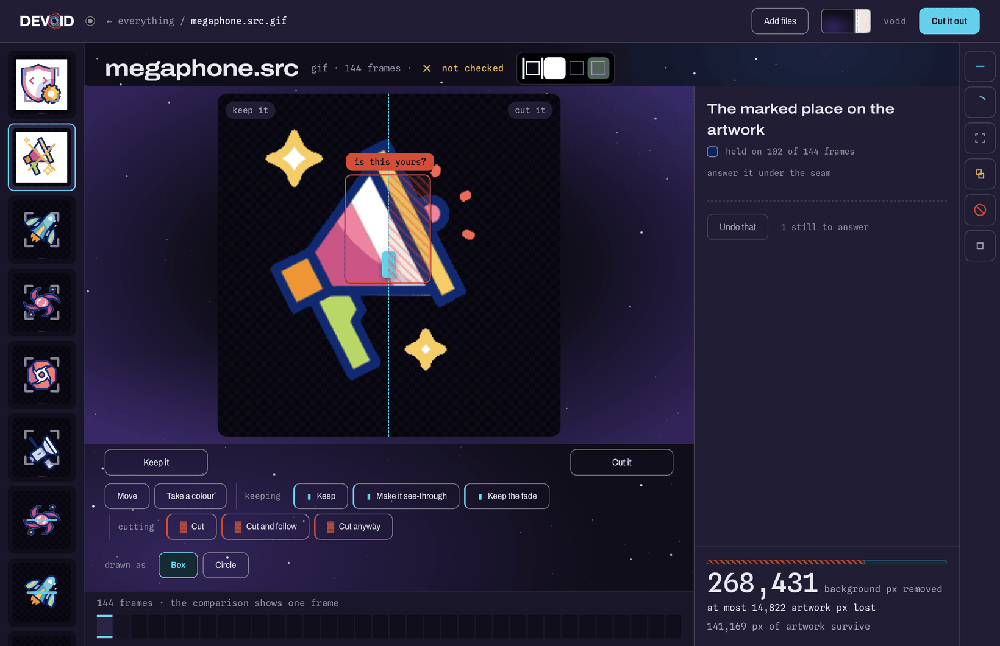

<div align="center">


<p><b>Cut the background out of an animated image.<br>Answer the one question no tool can answer for you.</b></p>


<a href="docs/CHANGELOG.md"></a>


</div>

**Devoid is a macOS desktop app for cutting the background out of animated images** — GIF, WebP, AVIF, APNG, and static PNG and JPEG. It drives the [`gif-background-remover`](https://github.com/HarkiratMangat/gif-background-remover) engine, which does all the image processing, and it exists to ask you the one thing that engine refuses to guess at.

<br>

## The question

Somewhere in about one animated image in ten there is a patch of background colour **enclosed by the artwork** — on some frames, not all. Is it a hole you can see through, or is it part of the drawing?

The pixels do not answer that. It is a question about intent, so a background remover either guesses or refuses. The engine refuses rather than guessing: **10.2%** of its 304-asset corpus raise this question, **12.8%** raise this one or a second one about a fade. Either way it hands you a hex colour and a bounding box.

Nobody can answer that by reading it.

<div align="center">


</div>

<table>
<tr>
<td width="50%" valign="top">

<b> &nbsp;Keep it</b>

The interior is part of the drawing. It gets protected, and the engine is told which colour to protect by name.

</td>
<td width="50%" valign="top">

<b> &nbsp;Cut it</b>

The interior is background showing through. It goes, along with everything else of that colour.

</td>
</tr>
</table>

Answer it and the engine proceeds. Every option you *didn't* touch stays at its default, which is what keeps the engine's own `--auto` deciding the rest of them for you.

<br>

## Get it

⚠️ **Both repositories are private.** Every link on this page — the clones, the releases, the issue tracker — needs access to the `HarkiratMangat` account to resolve.

**What you need first.** The last two will stop the install below if you skip them.

| | |
|---|---|
| **macOS on Apple silicon** | The published disk image is `arm64` because that is the machine that built it — `electron-builder.yml` pins no architecture, so a build on an Intel Mac would produce an Intel one. Untried, and nothing declares a minimum macOS version; Electron 44's own floor applies. |
| **Python 3.11** | Any 3.11 — Homebrew's, python.org's, pyenv's. `main.js` probes `/opt/homebrew/bin/python3` among others, and the source install just uses whatever `python3.11` is on your `PATH`. ⚠️ **3.11 exactly**: `pyproject.toml` declares `requires-python = ">=3.11"` and the interpreter probe enforces it, so a 3.10 is rejected with a dialog. |
| **`gifsicle` · `pngquant` · `webpmux`** | The engine shells out to all three. Without them it reports itself degraded. |
| **The engine, on disk** | [`gif-background-remover`](https://github.com/HarkiratMangat/gif-background-remover). **v6.3.3 is the floor**, v6.4.0 adds the speed-up below, v6.4.1 is current. It is deliberately not bundled: the engine is the source of truth for every algorithm, and a copy inside the app would drift from it silently. |

Then:

```sh
brew install gifsicle pngquant webp
git clone https://github.com/HarkiratMangat/gif-background-remover.git
git clone https://github.com/HarkiratMangat/Devoid.git && cd Devoid
echo "{\"skill_path\":\"$(cd ../gif-background-remover && pwd)/scripts/remove_gif_background.py\"}" > devoid.config.json
npm install && python3.11 -m venv .venv && .venv/bin/pip install -e .
npm start
```

There is a disk image on the [releases page](https://github.com/HarkiratMangat/Devoid/releases). It is signed with a **self-signed certificate**, so Gatekeeper blocks a double-click on any Mac but the one that built it — <kbd>right-click</kbd> → <kbd>Open</kbd> still works. Building from source is the path that works anywhere.

⚠️ **One thing about the disk image that the source install does not have.** It carries a virtual environment built on *this* machine, and a virtualenv hardcodes the path of the interpreter it was built against — here, python.org's framework build under `/Library/Frameworks/`. If that interpreter is missing on your Mac the bundled environment is dead, and Devoid falls back to a system Python 3.11 and offers to install the packages it needs. That fallback works; it is just slower than building from source, where the question never comes up.

<br>

## How it goes

**1 · Drop files in.** Each one is read once.

**2 · Find the one that needs you.** It sorts to the front, carries a mark, and in a crowd takes a wider tile — so you spot it by shape, without reading.

<div align="center">

<picture>
  <source media="(prefers-color-scheme: dark)" srcset="docs/shots/12-sheet-void.png"> <source media="(prefers-color-scheme: light)" srcset="docs/shots/11-sheet-emitting.png">
  
</picture>

</div>

**3 · Answer the question.** Your answer applies to every region sharing that outline colour, because the engine takes colours rather than region ids.

**4 · Or see both answers first.** Drag the seam. Two renders of the same asset, one for each answer, both playing.

<div align="center">


</div>

**5 · Say what you want out of it, or say nothing.** A size cap, a format, or neither. Left alone the engine renders at full resolution and infers nothing — guessing a size target is a mistake this app is built not to make.

**6 · Cut.** The file lands beside your source as `<name>_transparent.<ext>`, escalating to `_v2` rather than overwriting anything.

**7 · Read the verdict.** Leftover background, protected-region coverage, edge fringe, timing — once a verification has actually run. Until then the header says so:

<div align="center">



</div>

**Not checked** carries the same weight on screen as done and failed. An unearned green tick is worse than none.

<br>

## What makes it different

<table>
<tr><th width="30%" align="left">the idea</th><th width="34%" align="left">what it means</th><th width="36%" align="left">the evidence</th></tr>
<tr>
<td><b>Three states, not two</b></td>
<td>A control reads <code>auto · what the tool would do</code> until you take it over. A switch can be on, off, <b>or left to the engine</b></td>
<td>the engine only fills in options left at their default — send it every option and it stops thinking</td>
</tr>
<tr>
<td><b>The answer is a drag</b></td>
<td>Two renders, one seam, both animating</td>
<td>the same shape works for any option with a visible consequence</td>
</tr>
<tr>
<td><b>Never claims a check it didn't run</b></td>
<td>No inferred size targets, no unearned verdicts</td>
<td><i>not checked</i> is a first-class state</td>
</tr>
<tr>
<td><b>Colour is never the only signal</b></td>
<td>Every state carries a mark or a word too</td>
<td>on two real corpus assets, <b>31%</b> and <b>21%</b> of the artwork sits inside the same red the app uses for <i>this goes</i></td>
</tr>
<tr>
<td><b>Half the render time</b></td>
<td>The analysis behind your questions is handed straight to the render instead of recomputed</td>
<td><b>4.3s</b> instead of <b>9.8s</b> on one measured asset, byte-identical output — needs engine v6.4.0</td>
</tr>
<tr>
<td><b>Advice ships with its undo</b></td>
<td>Every suggestion reverses exactly what it changed</td>
<td>every preset number is cited from the engine's own measurements</td>
</tr>
</table>

<br>

## Your files

Your images never leave the machine. The app touches the network twice, and you start both: **Check for Updates…** in the menu, and a one-time offer to install missing Python packages.

Finished renders land beside their source files. Your job history goes in `jobs.jsonl` under `~/Library/Application Support/Devoid/`, which is also where the logs are.

<br>

## Troubleshooting

**Nothing happens when I add a file.** The engine is missing, or older than v6.3.3. Devoid names the three paths it looked at — but only in its console output, because the startup dialog for this is a known gap. Run `npm start` from a checkout to see it.

**It asks for Python packages.** Approve the offer, or set `$DEVOID_PYTHON` to an interpreter that already has them. It installs nothing unasked, and refuses rather than guessing when the interpreter it found has no working `pip`.

**macOS won't open the app.** <kbd>right-click</kbd> → <kbd>Open</kbd> → confirm.

**The packaged app ignores `$DEVOID_SKILL`.**

| | |
|---|---|
| symptom | A `.dmg` install only ever finds the engine at the documented fallback path |
| cause | An app launched from Finder inherits no shell environment, and `devoid.config.json` is read from inside the bundle, where writing breaks the signature |
| workaround | `launchctl setenv DEVOID_SKILL <path>`, then reopen. Running from a checkout has neither problem |

**Getting the logs.** Launch from a terminal to see the engine and port diagnostics the window doesn't show:

```sh
/Applications/Devoid.app/Contents/MacOS/Devoid
```

**Uninstalling.** Drag to the Trash, then delete `~/Library/Application Support/Devoid/`.

**Still stuck?** [Open an issue](https://github.com/HarkiratMangat/Devoid/issues), with that console output if the engine is involved.

<details>
<summary><b>Settings</b></summary>

<br>

Devoid finds the engine by taking the first of these that resolves:

1. `$DEVOID_SKILL` — full path to `remove_gif_background.py`
2. a `skill_path` key in `devoid.config.json`
3. the documented fallback under `/Applications/Claude Code/` — see [Troubleshooting](#troubleshooting)

`$DEVOID_PYTHON` points at an interpreter that already has the packages. `$DEVOID_DATA_DIR` moves `jobs.jsonl` and the crash journal.

</details>

<details>
<summary><b>What it deliberately doesn't do</b></summary>

<br>

Each of these is a decision with a reason, not a gap.

| | |
|---|---|
| Notarised builds | No paid Apple Developer account. The variables stay unset, and no placeholder credential is supplied to make the path look testable. |
| Install its own updates | Squirrel.Mac only accepts a signature the destination already trusts, and the repository being private is a second, independent blocker. **Check for Updates…** opens the release page and stops. |
| A screen-reader pass | Not attempted yet. The states are legible without colour and the app is keyboard-operable, but no assistive-technology testing has been done and it does not claim otherwise. |
| Opening two assets at once | You can *select* many — click, shift-click a range, or **Select all** — and act on them together. Only one opens at a time, and that is what keeps the layout identical whether you dropped one file or two hundred. |
| Frame-accurate scrubbing | The film strip highlights and counts; the artwork is a looping `` that never seeks. Seeking needs a canvas decoder. |
| Controls that mirror engine options | New surface belongs in a question the app asks. The point is that you never learn the engine's options at all. |

Open work and the reasoning behind each: [`devoid-deferred-list.md`](devoid-deferred-list.md).

</details>

<br>

## More

[**Development guide**](docs/DEVELOPMENT.md) — building, packaging, signing, the eleven test gates · [**Contributing**](CONTRIBUTING.md) · [**Changelog**](docs/CHANGELOG.md) · [**The brief**](docs/PRODUCT.md), with the measurement behind every constraint

<br>

## Licence

**GPL-3.0-or-later** — see [LICENSE](LICENSE). Clone it, change it, ship it; a version you distribute stays open.

The engine is **LGPL-3.0-or-later** from v6.4.1, so anything may use it — including something closed — while improvements to the engine itself come back. Fonts under `web/fonts/` are [SIL OFL 1.1](web/fonts/README.md).

<sub>Copyright © 2026 Harkirat Mangat.</sub>
