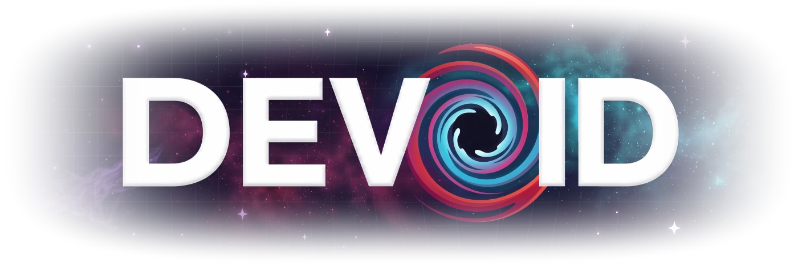
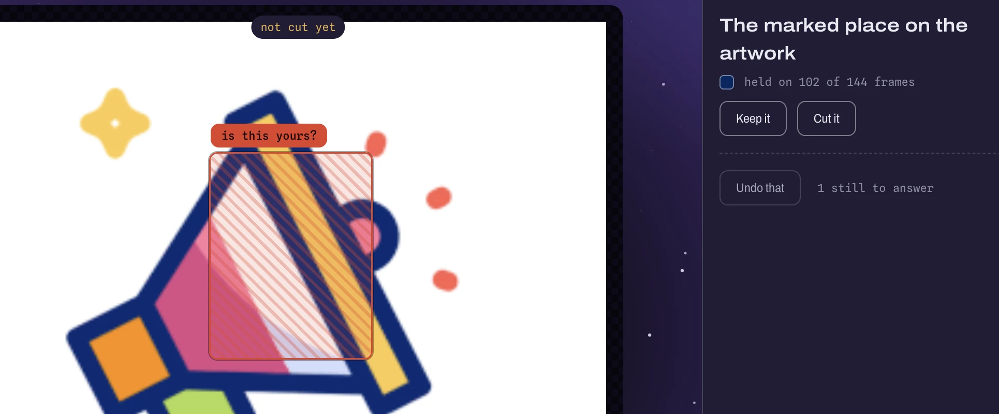
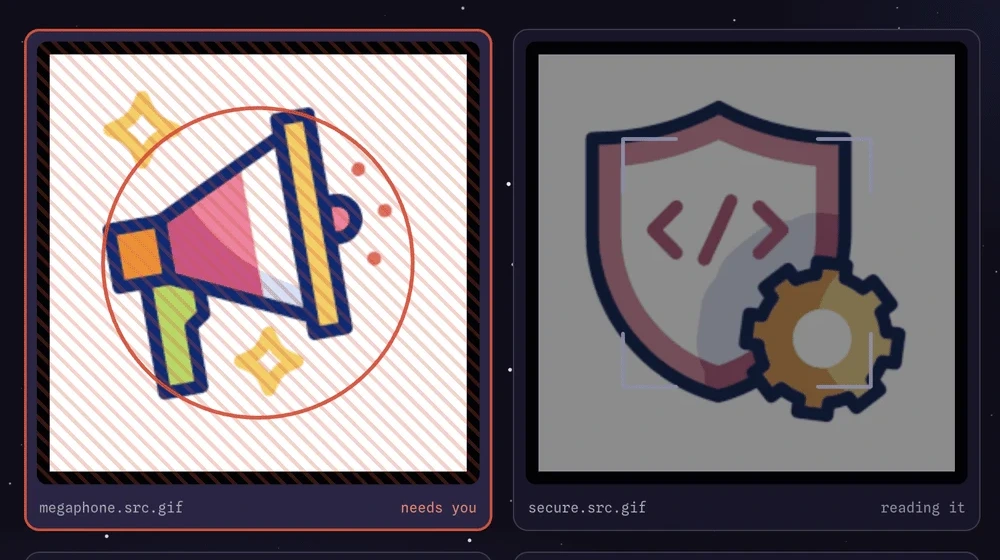
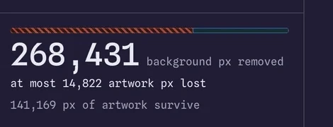
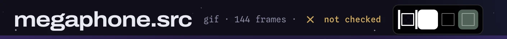

<div align="center">



<p><b>Cut the background out of an animated image.<br>Answer the one question the pixels can't.</b></p>

<a href="https://github.com/HarkiratMangat/Devoid/releases/latest"></a>

<p>
<a href="https://github.com/HarkiratMangat/Devoid/releases/latest"></a>

<a href="https://github.com/HarkiratMangat/Devoid/blob/main/LICENSE"></a>
</p>

<p><a href="#download-and-install">Download</a> &nbsp;·&nbsp; <a href="#the-engines-question">What it asks you</a> &nbsp;·&nbsp; <a href="#using-it">Using it</a> &nbsp;·&nbsp; <a href="#if-something-goes-wrong">If something goes wrong</a></p>

</div>

**Devoid removes the background from animated images on your Mac** — GIF, WebP, AVIF, APNG, and static PNG and JPEG. Drop files on the window, get transparent ones back beside them. Nothing is uploaded.

While most engines guess or restrict, Devoid's engine **asks**. The engine underneath will not guess at a question about what the artist meant — so instead of handing you a hex code and a bounding box to interpret, [Devoid marks the exact disputed pixels on the artwork](#the-engines-question) and takes your answer as a click.

<br>

## Download and Install

**1 · Download the disk image.**

> Get the latest `Devoid-<version>-arm64.dmg` from the [releases page](https://github.com/HarkiratMangat/Devoid/releases/latest).

**2 · Open it and drag Devoid into Applications.**

> Double-clicking the `.dmg` opens a window with the app and a shortcut to your Applications folder. Drag one onto the other, then eject the disk image from the Finder sidebar.

**3 · Open it the first time by right-clicking Devoid.app → Open.**

> [!IMPORTANT]
> **The app is not signed!** — A normal double-click will not work _the first time_. MacOS will say the app is _damaged_ or _from an unidentified developer_. It is neither — the app carries a self-signed certificate, not the official paid Apple one, and Gatekeeper only trusts Apple's.
>
> <details>
> <summary><b>How to Open an Unsigned App</b></summary>
>
> #### <ins>By right-clicking:</ins>
> * **Right-click Devoid → Open → Open**.
> * You do this once; every launch after that is a normal double-click.
>
> #### <ins>In System Settings:</ins>
> * Try to open the app and **dismiss the warning message** that says the app cannot be opened.
> * Open the **Apple menu** and select **System Settings**.
> * Click on **Privacy & Security** in the sidebar.
> * Scroll down to the **Security** section to find the blocked app.
> * Click **Open Anyway** and enter your login password to confirm.
>
> #### <ins>Using Terminal:</ins>
> * You can **remove the quarantine** attribute quickly using the Terminal App with the command:
> ```sh
> xattr -cr /path/to/Devoid.app
> ```
> * The path will likely be `/Applications/Devoid.app`.
>
> </details>

**4 · Say yes to the setup check.**

> On first launch Devoid looks at what your Mac already has and offers to install the rest — a few command-line tools and a few Python packages. It **asks before installing** either, and installs nothing you decline.

<details>
<summary><b>Or build it from source</b> — works on any Mac, including Intel</summary>

<br>

You need **Python 3.11 or newer**, plus **Node**, **npm**, **git** and the Xcode command line tools (`xcode-select --install`).

```sh
git clone https://github.com/HarkiratMangat/gif-background-remover.git
git clone https://github.com/HarkiratMangat/Devoid.git && cd Devoid
echo "{\"skill_path\":\"$(cd ../gif-background-remover \
  && pwd)/scripts/remove_gif_background.py\"}" > devoid.config.json
npm install && python3 -m venv .venv && .venv/bin/pip install -e .
npm start
```

Any Python 3.11 or later does — Homebrew's, python.org's, pyenv's. An older one is refused at launch with a dialog that says why.

More in the [development guide](docs/DEVELOPMENT.md).

</details>

<br>

## The Engine’s Question

Sometimes a patch of background colour sits **enclosed by the artwork** — inside a letter, a loop, a gap between limbs — and only on some frames.

**Is it a hole you can see through, or is it part of the drawing?**

Nothing in the pixels answers that. It is a question about what the artist meant, so every background remover has to either guess or hand it back. Devoid draws it where it is:

<div align="center">



</div>

<table>
<tr>
<td width="50%" valign="top">

**◆ Keep it**

Part of the drawing. It gets protected, by colour, everywhere it appears.

</td>
<td width="50%" valign="top">

**✕ Cut it**

Background showing through. It goes, along with everything else that colour.

</td>
</tr>
</table>

Not sure? **Drag the seam** — a divider you pull across two renders of the same file, one for each answer, both playing — and watch both before you pick.


<br>

## Using It

**1 · Drop files in.** Whichever ones need you sort to the front, carry a mark, and take a wider tile — you spot them by shape, without reading.

<div align="center">



</div>

**2 · Answer.** Click **Keep it** or **Cut it** — or drag the seam first and compare.

**3 · Set a size or format target, or don't.** Left alone, Devoid renders at full resolution and invents nothing. Guessing at a size you didn't ask for is a mistake this app is built to avoid.

**4 · Cut.** The file lands beside your original as `<name>_transparent.<ext>`, going to `_v2` rather than overwriting anything.

**5 · Read the verdict.** How much background went, how much of what you protected survived, and the edge quality:

<div align="center">



</div>

**Until something has actually been measured, it says `not checked` instead of guessing** — in the title bar, at the same weight as done and failed:

<div align="center">



</div>

<br>

## Why It Works This Way

<table>
<tr><th width="30%" align="left">The idea</th><th width="34%" align="left">What it means</th><th width="36%" align="left">Why it holds</th></tr>
<tr>
<td><b>Three states, not two</b></td>
<td>A control reads <code>auto · what the tool would do</code> until you take it over. A switch can be on, off, <b>or left to the engine</b></td>
<td>the engine only fills in options left at their default — send it every option and it stops thinking</td>
</tr>
<tr>
<td><b>The answer is a drag</b></td>
<td>Two renders, one seam, both animating</td>
<td>you are choosing between two pictures, which is the form the question actually has</td>
</tr>
<tr>
<td><b>Never claims a check it didn't run</b></td>
<td>No inferred size targets, no unearned verdicts</td>
<td><i>not checked</i> renders at the same weight as done and failed, rather than as an absence</td>
</tr>
<tr>
<td><b>Colour is never the only signal</b></td>
<td>Every state carries a mark or a word too</td>
<td>on <code>hurricane</code> and <code>paper-plane</code> from the engine's corpus, <b>31%</b> and <b>21%</b> of the artwork sits within RGB distance 90 of the red the app uses for <i>this goes</i> — close enough that hue alone would not have read (<code>web/app.css:19</code>)</td>
</tr>
<tr>
<td><b>Advice ships with its undo</b></td>
<td>Every suggestion reverses exactly what it changed</td>
<td>an undo is written at the same time as the change, so a suggestion that cannot be reversed cannot ship</td>
</tr>
</table>

<br>

## Your Files

Your images never leave the machine, and nothing about them is ever sent anywhere.

Devoid contacts the network twice, both about versions rather than about your work:

| When | What |
|---|---|
| **once a day, at launch** | asks GitHub what the newest Devoid and the newest engine are. Silent unless something is newer, downloads nothing, and opens a release page only if you click. Turn it off with **Check for Updates on Launch** in the menu, or from the dialog itself |
| **the first launch** | offers to install the command-line tools and Python packages it needs. It asks first, and installs nothing you decline |

Finished renders land beside their sources. Your job history goes in `jobs.jsonl` under `~/Library/Application Support/Devoid/`, which is also where the logs and preferences are.

<br>

## If Something Goes Wrong

| What you see | What to do |
|---|---|
| **Nothing happens when I add a file** | Devoid cannot find the engine, or the one it found is too old. It says which at launch, and names every path it tried |
| **It is asking to install things** | That is the first-launch setup check. Approve it — or install `gifsicle`, `pngquant` and `webp` yourself with Homebrew. It installs nothing you decline |
| **macOS says the app is damaged, or will not open it** | Right-click it → **Open** → **Open**. Once only |
| **I set `$DEVOID_SKILL` and it was ignored** | An app opened from Finder inherits no shell environment, so it never sees your variable |

> [!TIP]
> `launchctl setenv DEVOID_SKILL /path/to/remove_gif_background.py`, then reopen Devoid. Running from a checkout has neither problem, and `$DEVOID_PYTHON` and `$DEVOID_DATA_DIR` work the same way — see the [development guide](docs/DEVELOPMENT.md).
>
> ---
>
> **To see the logs**, launch Devoid from a terminal. The engine and port diagnostics never reach the window.
>
> ```sh
> /Applications/Devoid.app/Contents/MacOS/Devoid
> ```

### To uninstall
Drag it to the Trash and delete `~/Library/Application Support/Devoid/`.

<br>

**Still stuck?** [Open an issue](https://github.com/HarkiratMangat/Devoid/issues), with that console output if the engine is involved.

<br>

## What it doesn't do

| | kind | |
|---|---|---|
| Notarised builds | outside our control | No paid Apple Developer account. The variables stay unset, and no placeholder credential is supplied to make the path look testable |
| Install its own updates | **not built** | Squirrel.Mac, the usual mechanism, needs a signature the destination already trusts and this build is self-signed. Other mechanisms exist — Sparkle carries its own key — and none is wired up |
| Write to the engine for you | decided | It tells you when a newer one is published. `git pull` in that repository is yours to run |
| A screen-reader pass | **not built** | The states are legible without colour and the app is keyboard-operable, but no assistive-technology testing has been done and it does not claim otherwise |
| Opening two files at once | **not built** | You can *select* many — click, shift-click a range, or **Select all** — and act on them together. Only one opens at a time |
| Frame-accurate scrubbing | **not built** | The film strip highlights and counts; the artwork is a looping `` that never seeks. Frame decoding exists for GIF in the seam ([`web/vendor/gifuct.js`](web/vendor/)); wiring it to the film strip, and finding a decoder for WebP, AVIF and APNG, is the unbuilt part |
| Controls that show you engine flags | decided | A control may offer an engine capability; it may never show you a flag. *"Keep the fade"* is a control, `--recover-fade-alpha` is a passthrough, and you only ever meet the first |
| Photographs | decided | This separates a flat background from artwork drawn against it. It is not subject segmentation, and a photo of a person against a wall is not what it is for |

> [!NOTE]
> *Outside our control* is a fact nobody here can change. *Decided* is a choice with a reason. *Not built* is not built. If no reason is offered, it means there isn't one beyond nobody having done it yet.
>
> Open work and the reasoning behind each: [`devoid-deferred-list.md`](devoid-deferred-list.md).

<br>

## More

- [**Development guide**](docs/DEVELOPMENT.md) — building, packaging, signing, the test gates
- [**Contributing**](CONTRIBUTING.md) and the [**code of conduct**](CODE_OF_CONDUCT.md)
- [**Changelog**](docs/CHANGELOG.md) — what shipped, and when
- [**The brief**](docs/PRODUCT.md) — the measurement behind every constraint

<br>

## Licence

**GPL-3.0-or-later** — see [LICENSE](LICENSE). Clone it, change it, ship it; a version you distribute stays open.

The image processing is done by [`gif-background-remover`](https://github.com/HarkiratMangat/gif-background-remover), **LGPL-3.0-or-later**, which ships inside the app. Fonts under `web/fonts/` are [SIL OFL 1.1](web/fonts/README.md).

<sub>Copyright © 2026 Harkirat Mangat.</sub>
