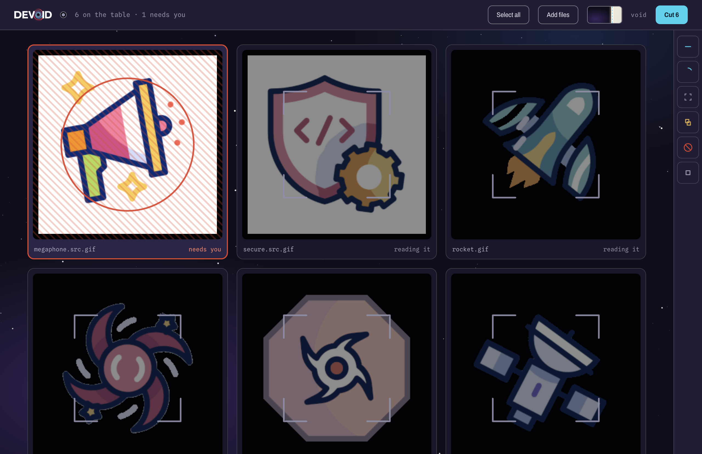
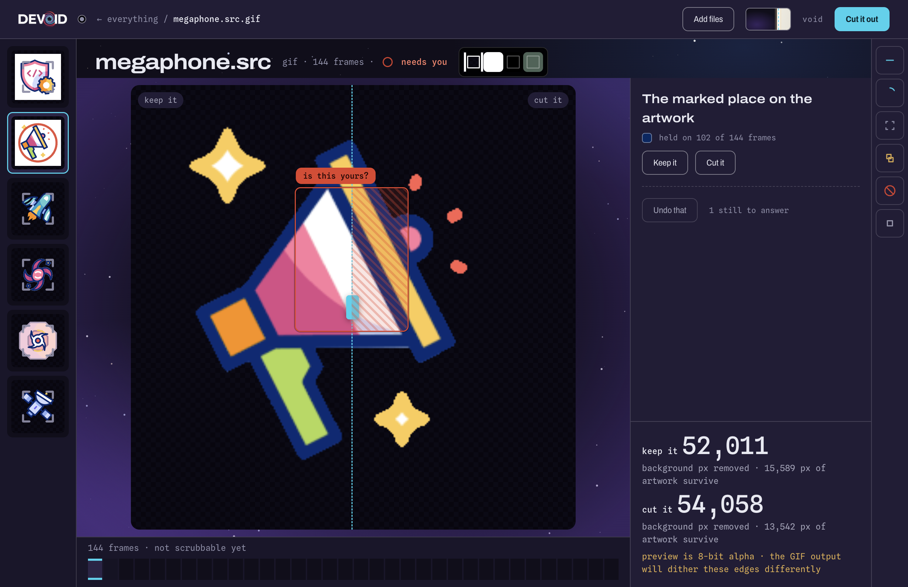
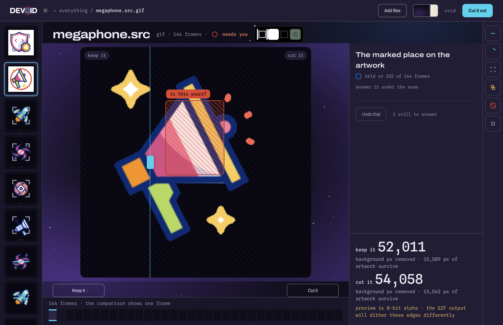
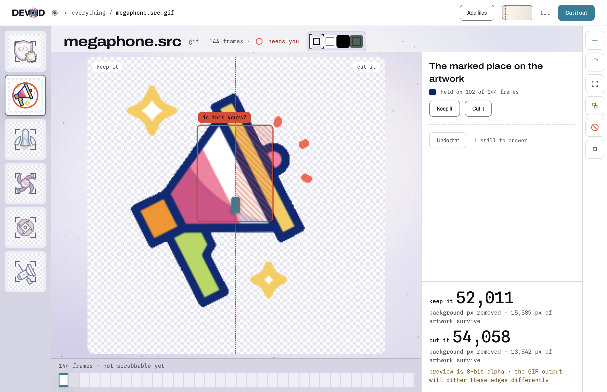

  

  <b>Remove the background from an animated image, and answer the two questions no tool can answer for you.</b> 
  macOS · runs entirely on your machine · <code>v1.0.0</code>

---

Devoid handles GIF, WebP, AVIF and APNG, plus static PNG and JPEG, and can fit the result to a size or format target. It is a front end for the [`gif-background-remover`](https://github.com/HarkiratMangat/gif-background-remover) skill, which does all the image processing.

Nothing is uploaded. The app makes no network request unless you click **Check for Updates…**.

[Why it exists](#why-it-exists) · [Screenshots](#screenshots) · [Requirements](#requirements) · [Install](#install) · [First run](#first-run) · [Using it](#using-it) · [Features](#features) · [Settings](#settings) · [What it does not do](#what-it-does-not-do) · [For developers](docs/DEVELOPMENT.md)

## Why it exists

The engine has 63 command-line options, and that is not the friction it looks like: its own `--auto` already picks them. The friction is a question it refuses to guess at.

When a patch of background colour sits enclosed by the artwork on some frames but not all, whether that interior is design to protect or background showing through is a statement about intent. The pixels do not answer it. Across 304 measured assets the engine refuses **10.2%** of them (31) on that question alone, and **12.8%** (39) once a second question is counted: a region that fades toward the background colour, which it can find but cannot classify.

The refusal arrives as prose naming a hex colour and a bounding box. Nobody can answer that by reading it. You have to see it.

Devoid draws the region in doubt on the artwork and takes your answer as a click. The engine then never refuses, and every other option stays untouched so it keeps deciding those.

## Screenshots

  

Assets arrive on a contact sheet. The one that needs you sorts to the front, is marked, and in a crowd keeps two columns so you can find it by shape without reading a word.

  

Open it and the question is drawn on the art: the region the engine could not classify, outlined in place, with **Keep it** and **Cut it**.

  

Drag the seam to see both answers at once. Two renders of the same asset, one dashed line between them, both playing.

  

While a render is in flight the field washes back, so the work in progress is the only thing at full strength.

## Requirements

Read this before downloading.

| | |
|---|---|
| **macOS on Apple silicon** | The published build is `arm64`. No Intel build is produced. |
| **Python 3.11 from [python.org](https://www.python.org/downloads/)** | The app ships its own virtual environment, and a virtualenv still needs its base interpreter at `/Library/Frameworks/Python.framework/Versions/3.11`. |
| **The engine, on disk** | [`gif-background-remover`](https://github.com/HarkiratMangat/gif-background-remover) at **v6.4.0 or later**. It is deliberately not bundled: the skill is the source of truth for every algorithm, and a copy inside the app would drift from it silently. See [Settings](#settings) for how the path is found. |

⚠️ **The disk image is signed with a self-signed certificate, not an Apple Developer ID.** It does not satisfy Gatekeeper on any machine other than the one that built it, and another Mac will refuse to open it. There is no paid Apple Developer account behind this project and notarisation is not planned. On any other machine, [build from source](docs/DEVELOPMENT.md) instead.

## Install

Download `Devoid-1.0.0-arm64.dmg` from [Releases](https://github.com/HarkiratMangat/Devoid/releases), open it, and drag Devoid into Applications. Subject to the signing note above.

To build it yourself, see [docs/DEVELOPMENT.md](docs/DEVELOPMENT.md).

## First run

Two things can be missing, and each one is a dialog that names the fix rather than a window that never opens.

**Python.** The app looks for its bundled interpreter, then for a system Python 3.10 or newer. If it finds one but the packages it needs are absent, it asks — *"Devoid needs a few Python packages"* — with **Install them** and **Quit**. Approve it once and it installs them into the right place, choosing `--user` or the virtual environment as appropriate. It installs nothing without being asked, and it refuses rather than guessing when the interpreter it found has no working `pip`.

**The engine.** If the skill is not where Devoid expects, it says so and names all three places it looked.

**Where your work is recorded.** `jobs.jsonl` lives under `~/Library/Application Support/Devoid/`. Nothing is written inside the app bundle.

## Using it

1. **Add files.** Drop them on the window or press **Add files**.
2. **Wait for the read.** Each asset is analysed once. Most come back ready; roughly one in eight comes back with a question.
3. **Answer it.** The region in doubt is outlined on the artwork. **Keep it** protects that interior, **Cut it** removes it. An answer applies to every region sharing that outline colour, because the engine's flags take colours rather than region ids. If a fade is in question, you are asked whether it is artwork.
4. **Compare first, if you want to.** Drag the seam to see both answers on the same asset, both playing.
5. **Say what you want out of it, or say nothing.** A goal is a size cap, a format, or neither. Left alone, the engine renders at full resolution and infers nothing.
6. **Cut.** The render runs, then re-measures the file it wrote and corrects once if the encoded result disagrees with the calibration.
7. **Read the verdict.** Leftover background, protected-region coverage, edge fringe and timing, per run. **Not checked** carries the same visual weight as done and failed, because a green tick that was not earned is worse than no tick.
8. **Reuse it.** History replays a previous run's settings onto a new file, and says so if the engine has moved underneath the line it is replaying.

## Features

**Every control is tri-state.** Each option reads `auto · <value>` until you take it over, and only what you changed is sent. That is load-bearing rather than tidy: `--auto` applies its recommendation only where an option was left at its default, so an interface that sends all 63 flags turns `--auto` into a no-op and the engine stops thinking.

**The question is visual and the answer is a drag.** Two renders, one seam, both animating. It generalises to any option with a visible consequence.

**Verification is reported, never assumed.** The app never infers a size target and never claims a check the run did not perform.

**Nothing is legible by colour alone.** Every state carries a mark or a word as well. The reason is measured: across eight real corpus assets, 31% of one asset's artwork and 21% of another's fall inside the same hue the app uses to mean *this goes*. `prefers-reduced-motion` is honoured throughout.

**The sheet knows how much is on it.** Tiles are 365px at six assets or fewer, 282px to forty, 154px beyond, and past forty the tile that needs you keeps two columns — while such tiles are still a minority, because a landmark every tile carries is not a landmark. A size change waits for a drop to finish arriving rather than resizing everything under your cursor.

**One analysis per render, not three.** Devoid hands the engine the analysis it already computed. Measured on a 743 KB 8-frame asset: `analyze()` runs **0 times instead of 2**, and a render takes **4.28s instead of 9.84s**, with identical output bytes. Needs the engine at v6.4.0; against an older one the app detects the missing flag and pays the old cost.

**Advice ships with an undo** of exactly what it changed, and every number in a preset is cited from the engine's own measurements.

## Settings

**Where the engine is.** Devoid checks these in order and takes the first hit:

1. `$DEVOID_SKILL` — full path to `remove_gif_background.py`
2. `devoid.config.json` at the repository root, with a `skill_path` key
3. `/Applications/Claude Code/Gif-Background-Remover/scripts/remove_gif_background.py`

**Where your data goes.** `$DEVOID_DATA_DIR` overrides the location of `jobs.jsonl` and the crash journal.

**Updates.** **Devoid → Check for Updates…** asks GitHub for the newest published release and offers to open its page. It never checks on launch, only when you click it: a version ping at startup would quietly break the premise that this app talks to nothing. It cannot install an update — see below.

## What it does not do

Each of these is a decision with a reason, not a gap waiting to be filled.

| | why |
|---|---|
| Notarised builds | No paid Apple Developer account. The variables that would drive it stay unset, and no fake credential is supplied to make the path look testable. |
| Installing its own updates | Squirrel.Mac validates the signature of what it downloads, and a self-signed build cannot pass that. Wiring an updater would ship a path that fails at runtime. |
| A screen-reader pass | Not attempted at this stage. The states are legible without colour and the app is keyboard-operable, but no assistive-technology testing has been done and the app does not claim otherwise. |
| Multi-select | Selection is the only state of the structure, which is what lets one asset and two hundred be the same layout. |
| Frame-accurate scrubbing | The film strip highlights and counts; the artwork is a looping `` that never seeks. Seeking needs a canvas decoder. |
| Controls that map onto engine flags | New surface belongs in a goal the app asks about, never as a passthrough. The point is that you never learn the 63 flags. |

## For developers

Building, packaging, signing, the test suite and the repository layout are in **[docs/DEVELOPMENT.md](docs/DEVELOPMENT.md)**.

## Licence

Not yet chosen. Until one is added, all rights are reserved.
