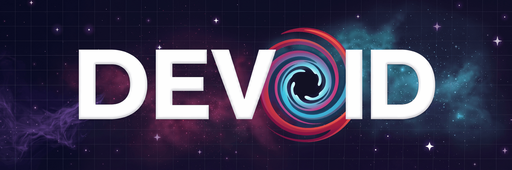

<p align="center">
  
</p>

# Devoid

A local desktop app for removing the background from animated images — GIF, WebP, AVIF, APNG, and static PNG/JPEG — and fitting the result to a size or format target.

It is a front end for the [gif-background-remover](https://github.com/HarkiratMangat/gif-background-remover) skill, which stays the engine. Devoid reimplements no image processing.

## Why a front end

The skill exposes **63 command-line options**, but that is not the friction it looks like — its own `--auto` already picks them. The friction is three questions: a coin-flip protection decision that fires on **10.2% of assets** (measured across 304; 12.8% pooled with the fade question), a fade it can name but not classify, and the size/format goal it deliberately never guesses.

The first two are visual questions delivered as prose naming a hex colour and a bounding box. Nobody can answer them by reading. **They have to see it.** That is the product.

`--recommend` already returns all three as structured JSON before anything renders, so Devoid reads the questions first, answers them, and `--auto` never refuses.

## The shape

**There is no mode — the strip is the app.** Nothing selected and it fills the space as a contact sheet; select one and it opens while the rest stay along the edge; panels are drawers summoned at the edge. Selection is the only state, so one asset and two hundred are the same layout.

**The core interaction is a seam you drag.** Two renders of the same asset, one dashed cut line between them, both playing. Instead of *"is this region design or background?"* — an analyst's question — you see both answers and pick. It generalises to every flag with a visible consequence.

## Layout

| | |
|---|---|
| `docs/HANDOFF.md` | **read first** — state of the work, decisions, rejected options, and the model to run the build session on |
| `docs/PLAN.md` | the implementation plan — opens with a literal ten-step sequence |
| `docs/PRODUCT.md` | what it is, who for, the non-negotiable constraints and the measurements behind them |
| `docs/DESIGN.md` | the visual system — tokens, type, layout, motion, and the checks it has to keep passing |
| `web/` | the front end: real state, real interactions, real corpus assets |
| `server/` | the local HTTP server that fronts the skill |

## Running the app

```sh
npm start
```

Electron's main process spawns the Python server and opens the window. Clicking a frame opens it, the seam drags, the drawers summon, and the lighting toggle in the header — a miniature of the wipe — sweeps between the two states of the room.

For a real `.app`: `npm run dist` builds a `.dmg` you can drag into Applications. It carries its own Python and runs from anywhere — see Packaging for the two things it still expects to find on the machine.

⚠️ **To check anything visual, use the real window** — `npx electron scripts/capture-window.mjs` captures every state through Electron itself. A browser pane reports `visibilityState: hidden` and fires no `requestAnimationFrame`, which makes rAF-driven UI look broken when it is not. ⚠️ **The film strip does not scrub yet** — it highlights and counts, but the artwork is a looping `` that never seeks. Frame-accurate seeking needs a canvas decoder; it is `PLAN.md` 3.3.

The assets in it are **real outputs from the skill's own corpus**, not icons drawn to flatter the layout — which is how the overlay bug in `docs/DESIGN.md` was found.

**Port.** Devoid serves on `127.0.0.1:8732`. If that port is already taken — a second window, a crashed run — the main process probes upward to `8740` and takes the first free one, passing it to both uvicorn and the window. Only when all nine are busy does it stop, with a dialog saying so. The probe is a real TCP connect: something that accepts is listening, `ECONNREFUSED` is free, and a socket that neither accepts nor refuses is treated as busy.

**Fonts are local.** Archivo and Spline Sans Mono are self-hosted under `web/fonts/`, declared in `web/fonts.css`, so an app whose whole premise is local does not fall back to Helvetica when the network is gone — the width axis and `tabular-nums` are load-bearing in `docs/DESIGN.md`. Regenerate them with `python3 scripts/fetch-fonts.py`.

## Updates

**Devoid → Check for Updates…** asks the GitHub Releases API what the newest published release is, compares it with the running version, and — if there is a newer one — offers to open the release page so you can download the disk image.

⚠️ **It never checks on launch, only when you click it.** This app's premise is that it works on your machine with your files and talks to nothing; a version ping at startup would quietly break that for a feature nobody asked for at that moment.

⚠️ **It cannot install an update, and that is a signing constraint rather than a missing feature.** A real auto-updater on macOS runs through Squirrel.Mac, which **validates the code signature** of what it downloads — an unsigned build cannot install its own update, so wiring `electron-updater` today would ship a path that fails at runtime. See Signing below.

⚠️ **A 404 from GitHub is ambiguous and the dialog says so.** GitHub answers identically for "no releases published" and "this repository is private and you are anonymous", and this repository is private, so Devoid reports that it cannot tell which rather than claiming one.

## Packaging

```sh
npm run dist       # dmg + zip
npm run dist:dir   # just assemble the .app, skip the installer step
```

**The bundle runs outside this repo.** Verified 2026-09-05 by copying `Devoid.app` to `/tmp` and launching it there: it served `index.html`, `app.css`, `app.js` and the corpus assets, resolved the engine, and wrote its journal to `~/Library/Application Support/Devoid/` rather than inside itself.

Three things make that work, and each was a real failure before it:

| piece | why |
|---|---|
| `server/` and `web/` ship as **extraResources**, not inside `app.asar` | Python cannot read an asar, and Python is what imports the server *and* serves `web/` as static files. Inside the asar they are invisible to it |
| `.venv` ships as **`pyvenv`** in Resources | The old build spawned `.venv/bin/python` relative to its own directory, which exists only in this checkout |
| The two logs and the crash journal follow `$DEVOID_DATA_DIR` | `main.js` points it at `~/Library/Application Support/Devoid` when packaged. Writing inside the bundle breaks under signing and is wiped by the next install |

⚠️ **It is not yet portable to another Mac, and the two reasons are worth knowing.** `pyvenv` is a *virtualenv*, so it still needs its base interpreter — **Python 3.11 from the python.org framework at `/Library/Frameworks/Python.framework/Versions/3.11`**. And the engine is resolved at runtime, not bundled: `$DEVOID_SKILL`, then `devoid.config.json`, then `/Applications/Claude Code/Gif-Background-Remover/scripts/remove_gif_background.py`. **The skill is deliberately not copied in** — it is the source of truth for every algorithm, and a bundled fork would drift silently. Both failures are now dialogs naming the fix, not a window that never opens.

### Signing and notarisation (6.2)

Both are driven entirely by environment variables, and **all of them are deliberately unset in `package.json`**. With none set, `npm run dist` produces an unsigned, un-notarised build — which is fine for local use, and is what will happen if you run it today.

| variable | what it is for |
|---|---|
| `CSC_LINK` | path or base64 of the `.p12` Developer ID Application certificate |
| `CSC_KEY_PASSWORD` | that certificate's password |
| `APPLE_ID` | the Apple ID used for notarisation |
| `APPLE_APP_SPECIFIC_PASSWORD` | an app-specific password for that Apple ID, not the account password |
| `APPLE_TEAM_ID` | the Developer Program team ID |

To sign, set the first two. To notarise as well, set all five and flip `build.mac.notarize` to `true` in `package.json`. `build/entitlements.mac.plist` already carries what the hardened runtime needs to spawn the Python interpreter — without those entitlements a signed build launches and then fails at the spawn, which looks like a server bug and is not one.

**Neither path has been exercised here.** No certificate and no Apple ID were available, so the signed and notarised builds are configured but unverified.
